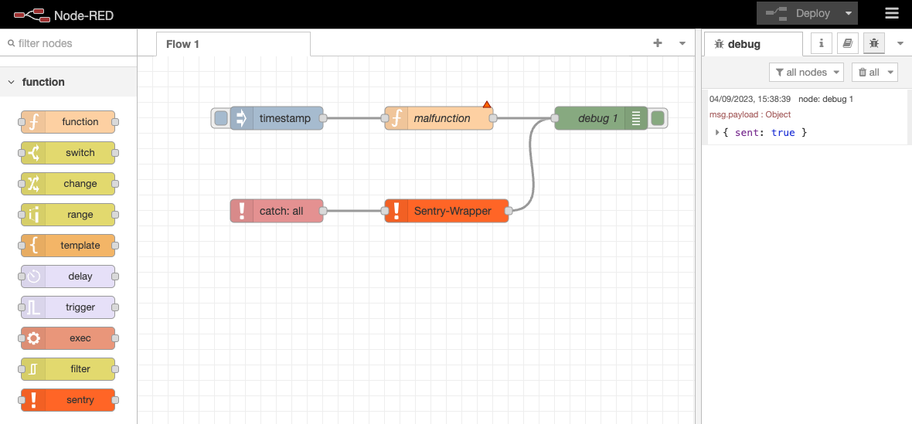

[](https://github.com/mpowr-it/node-red-sentry-node/actions/workflows/checks.yml)


# Node-RED Sentry Node

This package provides a custom node for [Node-RED](https://nodered.org/) that wraps the [Sentry](https://sentry.io) API 
for sending captured errors to your sentry project.

## Installation

### Install via Node-RED Manage Palette

Open your Node-RED instance and go to `Manage palette` and search for `mpowr-it-node-red-sentry-node`. 
Press the `install` button to install the node.

### Install via npm

```bash
cd ~/.node-red
npm install mpowr-it-node-red-sentry-node
```

## Usage

1. Pull the sentry node — you can find it in the "function" section of the palette — and drop it on the flow.
2. Double click the sentry node to configure it (see [Node properties](#Node-properties) below).
3. Drop a catch node (from "common" section) to capture all errors in the flow. 
4. Connect the catch node to the sentry node.

That's it.



## Node properties

### DSN 

This is the unique identifier of your sentry project. 
You can find it in your sentry project settings under `Client Keys (DSN)`.

### Environment

This tells Sentry which environment the error occurred in.

**Please note:** You can also set the environment via the `ENVIRONMENT` environment variable. 

If both are set, the node property takes precedence.

## Per message configurations 

The sentry node will look for the property `msg.sentry` and if found, 
any supported config will be set which is contained in the property.

### Supported `msg.sentry` configurations

**User information**
```json
{
  "user": {
    "id": "U123456",
    "username": "jdoe",
    "email": "jdoe@example.com",
    "ip_address": "127.0.0.1"
  }
}
```

**Additional tags**
```json
{
  "tags": {
    "some-tag-key-1": "some-tag-value-1",
    "some-tag-key-n": "some-tag-value-n"
  }
}
```

## How does it work?

If the `msg` object carries an error on its property `msg.error` it will be used and sent to your sentry instance. 
If the message objects also contains a `msg._error` property it will be added as breadcrumb for the error sent.

## Return value

The node will return a payload of type object having a boolean `sent` property that indicates if the
error has been sent to your Sentry project or not.

**Please Note:** `true` does not mean that the error was sent to your Sentry instance successfully, 
as it may fail due to invalid DSN for example, but it means that
this node captured the error, parsed it, and executed `Sentry.captureException`.

---

## Development

### Prerequisites

* docker-compose v2.0.0 or higher

### Setup

Clone the repository and run:

```bash
make serve
```

This will start a local Node-RED instance with the sentry node installed.

The web UI under http://127.0.0.1:1880/ will automatically open in your browser.

### Testing

```bash
make test
```

### Tear down

```bash
make stop
```